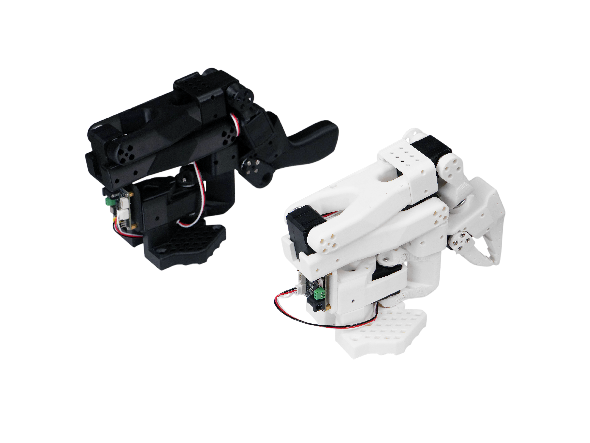
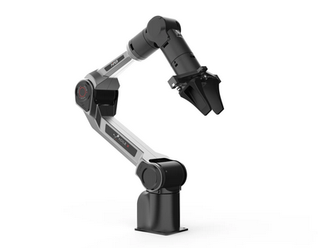

##### The purpose of this repository is to document and share my personal development journey.  
##### Through open-source collaboration and transparent technical sharing, supporting technical innovation. 


## so101 Leader Teleoperate so101 Followwer: Data Collection, Training, and Deployment    

---   


| Model       | Training Steps | Performance                     | Data | Task                           | Notes                                                                 |
|-------------|----------------|---------------------------------|------|--------------------------------|----------------------------------------------------------------------|
| ACT         | 50000          | Very good, almost 100%          | 50x2 | Pick objects from A to B       |                                                                      |
| SmolVLA     | 80000          | Very poor, hard to complete once | 50x2 | Pick objects from A to B       | Trained from scratch, 30k steps for fitting                         |
| ACT         | 80000          | Success rate 80%-100%           | 50x2 | Pick clothes from A to washing machine | 60k deployments, sometimes performance drops<br>Afternoon deployments nearly 100%<br>Morning tests also very good, close to 100% |
| SmolVLA_base | 60000         | Poor, can pick but rarely complete | 50x2 | Pick clothes from A to washing machine | Pretrained model, 20k steps fitting                                  |
| pi0fast     | 30000          | Very poor, cannot even pick      | 50x2 | Pick clothes from A to washing machine | Pretrained, 30k steps for initial fitting; model parameters huge     |
| ACT         | 100000         | Excellent, almost 90%-100%      | 62x3 | Pick natural clothes from laundry basket to washing machine | 90-100k steps fitting, last deployment, 3 cameras<br>Can sequentially pick clothes into washing machine; arm movement is natural |
| pi0fast     | 80000          | Very poor, HF pi0 model seems problematic | 62x3 | Pick natural clothes from laundry basket to washing machine | Deployed after ACT_100k with 90% success; many factors excluded; pi0fast last deployment = arm almost frozen;<br>40000 steps deployment also very poor |


      





## Demo 视频

点击观看 Demo 1:(https://www.youtube.com/shorts/5soQiujo6fU) 

点击观看 Demo 2:(https://www.youtube.com/shorts/BxUSwnyWUZQ)

 

点击缩略图跳转到 YouTube：

[](https://www.youtube.com/shorts/5soQiujo6fU) 


[](https://www.youtube.com/shorts/BxUSwnyWUZQ)


##### here is the information I will add later


## so101 Teleoperate piper: Data Collection, Training, and Deployment




 
### Hardware Setup and Check  

#### Device
RTX4090D-24G   
so101 Arm and piper   
Ubuntu20.04  


#### Check USB interfaces  
Run the following commands to check USB interfaces, mainly for **so101_leader arm** (based on my actual test):  

```bash
ls -l /dev/ttyACM*
sudo chmod +666 /dev/ttyACM*
```

---

#### Piper Interface Setup  

Navigate to the Piper SDK directory:  

```bash
cd /home/paris/X/piper/piper_sdk
```

Find all CAN ports:  

```bash
bash find_all_can_port.sh
```

Activate CAN port:  

```bash
bash can_activate.sh can0 1000000
```

---

##### Set video device permissions:  

```bash
sudo chmod 666 /dev/video*
```


Verify Camera Devices  

List available video devices:  

```bash
ls -l /dev/video*
```

Check camera index with `ffplay`:  

```bash
ffplay -f v4l2 -input_format mjpeg -video_size 640x480 -framerate 30 -i /dev/video0
```


---


### Robotic Arm Initialization Setup

#### Leader Arm Calibration (so101 arm requires separate calibration)

```bash
(lerobot) paris@x:~/X/so101/lerobot/src/lerobot$ 
python -m lerobot.calibrate \
    --teleop.type=so101_leader \
    --teleop.port=/dev/ttyACM0 \
    --teleop.id=R11
```

---

#### Piper Configuration Reference

Using `test_feetech_motor.py` to verify the relationship between raw position values and angles.  
For example, POS **2047** corresponds to **180 degrees**.

```bash
(lerobot) paris@x:~/X/so101/lerobot/src/lerobot/motors$ python test_feetech_motor.py --port /dev/ttyACM0 --id 1 --unit degrees read
Present_Position raw=997, degrees=87.64835164835165

(lerobot) paris@x:~/X/so101/lerobot/src/lerobot/motors$ python test_feetech_motor.py --port /dev/ttyACM0 --id 1 --unit degrees read
Present_Position raw=3141, degrees=276.13186813186815
```

---

#### Joint Calibration Table

```
NAME            |    MIN |    POS |    MAX
shoulder_pan    |    697 |   2047 |   3377
shoulder_lift   |    894 |   2047 |   3208
elbow_flex      |    881 |   2047 |   3066
wrist_flex      |    882 |   2047 |   3192
wrist_roll      |    114 |   2047 |   3945
gripper         |   2035 |   2047 |   3273
```

---

#### Follower Arm Calibration

```bash
(lerobot) paris@x:~/X/so101/lerobot/src/lerobot$ 
python -m lerobot.calibrate \
    --robot.type=so101_follower \
    --robot.port=/dev/ttyACM1 \
    --robot.id=R00
```


---

## practical experiments 


#### Teleoperate Execution

##### Run `teleoperate.py`


more personal detailed you can make a reference:   
The script can be run from the following directory:

```bash
cd /home/paris/X/so101/lerobot/src
```

```bash
python -m lerobot.teleoperate \
  --robot.type=piper \
  --robot.port=can0 \
  --teleop.type=so101_leader \
  --teleop.port=/dev/ttyACM0 \
  --teleop.id=R11 \
  --display_data=true
```

---

##### Run `teleoperate.py` with Camera Enabled

```bash
python -m lerobot.teleoperate \
  --robot.type=piper \
  --robot.port=can0 \
  --robot.cameras="{ handeye: {type: opencv, index_or_path: 1, width: 640, height: 480, fps: 30}}" \
  --teleop.type=so101_leader \
  --teleop.port=/dev/ttyACM0 \
  --teleop.id=R00 \
  --display_data=true
```


#### Record Execution


#### Deploy Execution


## > ⚙️ **Practical Experiment**


### Experiment 1

- **Date**: 2025-09-04  
- **Task information**: piper pick cloth from basket to laundry/washmachining 
- **Episodes Collected**: 30 + 20  
- **Training**: 120,000 steps completed  
- **Deployment Result**: Piper shows orientation errors (garbled directions due to LeRobot framework integration), but still attempts to grasp the cloth.  
- **pick rate**: Failed 


##### Data Collection

```bash
python -m lerobot.record \
  --robot.disable_torque_on_disconnect=true \
  --robot.type=piper \
  --robot.port=can0 \
  --robot.cameras="{'handeye': {'type':'opencv', 'index_or_path':0, 'width':640, 'height':480, 'fps':30}, 'fixed': {'type':'opencv', 'index_or_path':2, 'width':640, 'height':480, 'fps':30}, 'extra': {'type':'opencv', 'index_or_path':4, 'width':640, 'height':480, 'fps':30}}" \
  --teleop.type=so101_leader \
  --teleop.port=/dev/ttyACM0 \
  --teleop.id=R11 \
  --display_data=true \
  --dataset.repo_id=local/so101_piper_pick \
  --dataset.num_episodes=30 \
  --dataset.episode_time_s=50 \
  --dataset.reset_time_s=08 \
  --dataset.push_to_hub=false \
  --dataset.root=/home/paris/X/data/piper_data/piper_09_04 \
  --resume=true \
  --dataset.single_task="piper pick cloth"
```


##### Training (120,000 steps)

```bash
nohup python scripts/train.py \
  --dataset.repo_id=/home/paris/X/data/piper_data/piper_09_04 \
  --policy.type=act \
  --output_dir=outputs/train/piper/piper_120000 \
  --job_name=pick2wash \
  --policy.device=cuda \
  --batch_size=32 \
  --steps=120000 \
  --save_freq=5000 \
  --eval_freq=5000 \
  --log_freq=1000 \
  --policy.push_to_hub=false \
  > train.log 2>&1 &
```


##### Deployment

```bash
python scripts/deploy.py \
  --robot.type=piper \
  --robot.disable_torque_on_disconnect=true \
  --robot.port=can0 \
  --robot.cameras="{'handeye': {'type':'opencv', 'index_or_path':0, 'width':640, 'height':480, 'fps':30}, 'fixed': {'type':'opencv', 'index_or_path':2, 'width':640, 'height':480, 'fps':30}, 'extra': {'type':'opencv', 'index_or_path':4, 'width':640, 'height':480, 'fps':30}}" \
  --display_data=true \
  --dataset.single_task="piper pick cloth" \
  --policy.path=/home/paris/X/so101/lerobot/src/lerobot/outputs/train/piper/piper_120000/checkpoints/120000/pretrained_model \
  --policy.device=cuda \
  --dataset.episode_time_s=9999 \
  --dataset.repo_id=local/eval_piperpick21 \
  --dataset.push_to_hub=false
```


##### Model Location

```
/home/paris/X/so101/lerobot/src/lerobot/outputs/train/piper/piper_120000/checkpoints/last/pretrained_model
```


### Experiment 2


- **Date**: 2025-09-07  
- **Task Information**: piper pick cloth from ground to basket  
- **Episodes Collected**: 30 + 10  
- **Training**: 100,000 steps completed  
- **Deployment Result**: piper can successfully pick clothes into the laundry basket, but often limited to picking clothes only from a certain area  
- **Pick rate**: ~80%  


#### Data Collection

Successfully collected 30 + 10 episodes, dataset: put the clothes on the ground into the laundry basket  

```bash
python -m lerobot.record \
  --robot.disable_torque_on_disconnect=true \
  --robot.type=piper \
  --robot.port=can0 \
  --robot.cameras="{'handeye': {'type':'opencv', 'index_or_path':0, 'width':640, 'height':480, 'fps':30}, 'fixed': {'type':'opencv', 'index_or_path':2, 'width':640, 'height':480, 'fps':30}, 'extra': {'type':'opencv', 'index_or_path':4, 'width':640, 'height':480, 'fps':30}}" \
  --teleop.type=so101_leader \
  --teleop.port=/dev/ttyACM0 \
  --teleop.id=R11 \
  --display_data=true \
  --dataset.repo_id=local/so101_piper_pickA2B \
  --dataset.num_episodes=30 \
  --dataset.episode_time_s=40 \
  --dataset.reset_time_s=03 \
  --dataset.push_to_hub=false \
  --dataset.root=/home/paris/X/data/piper_data/piper_09_07 \
  --resume=true \
  --dataset.single_task="piper pick cloth A2B"
```

Add 10 more episodes key instruction:  

```bash
--resume=true \
```


#### Training (100,000 steps)

Training completed, model saved in:  

```bash
nohup python scripts/train.py \
  --dataset.repo_id=/home/paris/X/data/piper_data/piper_09_07 \
  --policy.type=act \
  --output_dir=outputs/train/piper/piper_100000 \
  --job_name=pick_cloth_A2B \
  --policy.device=cuda \
  --batch_size=32 \
  --steps=100000 \
  --save_freq=5000 \
  --eval_freq=5000 \
  --log_freq=1000 \
  --policy.push_to_hub=false \
  > train.log 2>&1 &
```


#### Deployment

Successful deployment: after 100,000 training steps, the final result is that **piper can successfully pick clothes, but often only limited to a certain area of clothes**.  

- Deployment of `/last/080000`, `/090000`, `/100000` models has similar performance.  
- Next steps: need to increase data and increase training steps (because at 100,000 steps, the loss did not converge).  

```bash
python scripts/deploy.py \
  --robot.type=piper \
  --robot.disable_torque_on_disconnect=true \
  --robot.port=can0 \
  --robot.cameras="{'handeye': {'type':'opencv', 'index_or_path':0, 'width':640, 'height':480, 'fps':30}, 'fixed': {'type':'opencv', 'index_or_path':2, 'width':640, 'height':480, 'fps':30}, 'extra': {'type':'opencv', 'index_or_path':4, 'width':640, 'height':480, 'fps':30}}" \
  --display_data=true \
  --dataset.single_task="piper_pickA2B" \
  --policy.path=/home/paris/X/so101/lerobot/src/lerobot/outputs/train/piper/piper_100000/checkpoints/065000/pretrained_model \
  --policy.device=cuda \
  --dataset.episode_time_s=9999 \
  --dataset.repo_id=local/eval_piperpickA2B15 \
  --dataset.push_to_hub=false 
```


---


### Experiment 3


**Date:** 2025-09-07  
**Task information:** piper pick cloth from basket to laundry  
**Episodes Collected:** 70  
**Training:** 120,000 steps completed  
**Deployment Result:** piper can successfully grab clothes into the washing machine, and also gradually pick the clothes hanging at the washing machine door into the washing machine.  
**Pick rate:** 90-95%  

##### Data Collection

Successfully collected **70 episodes**: piper dataset  

```bash

 python -m lerobot.record \
    --robot.disable_torque_on_disconnect=true \
    --robot.type=piper \
    --robot.port=can0 \
     --robot.cameras="{'handeye': {'type':'opencv', 'index_or_path':0, 'width':640, 'height':480, 'fps':30}, 'fixed': {'type':'opencv', 'index_or_path':2, 'width':640, 'height':480, 'fps':30}, 'extra': {'type':'opencv', 'index_or_path':4, 'width':640, 'height':480, 'fps':30}}" \
    --teleop.type=so101_leader \
    --teleop.port=/dev/ttyACM0 \
    --teleop.id=R11 \
    --display_data=true \
    --dataset.repo_id=local/so101_piper_pickC2washer \
    --dataset.num_episodes=30 \
    --dataset.episode_time_s=40 \
    --dataset.reset_time_s=5 \
    --dataset.push_to_hub=false \
    --resume=true \
    --dataset.root=/home/paris/X/data/piper_data/piper_09_08 \
    --dataset.single_task="piper pick cloth2washer"


```

```bash
--resume=true \
```

##### Training

Training **120,000 steps**, results saved at:  
`outputs/train/piper/piper_pickC2washer_120000`


```bash
  nohup python scripts/train.py \
  --dataset.repo_id=/home/paris/X/data/piper_data/piper_09_08 \
  --policy.type=act \
  --output_dir=outputs/train/piper/piper_pickC2washer_120000 \
  --job_name=piper_pickC2washer \
  --policy.device=cuda \
  --batch_size=32 \
  --steps=120000 \
  --save_freq=5000 \
  --eval_freq=5000 \
  --log_freq=1000 \
  --policy.push_to_hub=false \
  > train.log 2>&1 &


```


Check training progress:  

```bash
tail -f train.log 

```


##### Deployment

Deployment successful: after **120,000 steps training**,  
the result is that **piper can successfully pick clothes into the washing machine with high accuracy**, and also gradually pick the clothes hanging on the washing machine door into the washing machine.  
Currently, it cannot distinguish the basket boundary clearly.  
Models in `/last/` work.  
**Next step:** increase dataset size and training steps.


```bash
python scripts/deploy.py \
  --robot.type=piper \
  --robot.disable_torque_on_disconnect=true \
  --robot.port=can0 \
  --robot.cameras="{'handeye': {'type':'opencv', 'index_or_path':0, 'width':640, 'height':480, 'fps':30}, 'fixed': {'type':'opencv', 'index_or_path':2, 'width':640, 'height':480, 'fps':30}, 'extra': {'type':'opencv', 'index_or_path':4, 'width':640, 'height':480, 'fps':30}}" \
  --display_data=true \
  --dataset.single_task="piper_pickA2B" \
  --policy.path=/home/paris/X/so101/lerobot/src/lerobot/outputs/train/piper/piper_pickC2washer_120000/checkpoints/last/pretrained_model \
  --policy.device=cuda \
  --dataset.episode_time_s=9999 \
  --dataset.repo_id=local/eval_pickC2washer00 \
  --dataset.push_to_hub=false 

```


---
add one more for git
